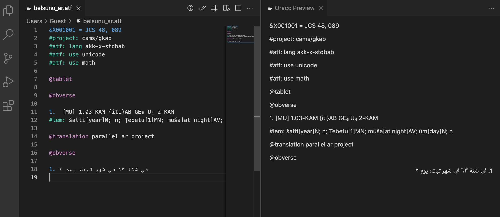

# Nisaba

This is the README of the Visual Studio Code extension "Nisaba", for the [ATF
format](http://oracc.museum.upenn.edu/doc/help/editinginatf/index.html), 
originally developed for the [ORACC Project](http://oracc.museum.upenn.edu/index.html) 
in order to view and edit documents recording the content of cunneiform tablets from
various ancient Mesopotamian cultures, translated and formatted for the modern reader.

## Development workflow

After cloning the repository, enter this directory and install the dependencies
with the command

```
npm install
```

Then you can compile, package, and install the extension with

```
npm run compile
npm run package
code --install-extension nisaba-0.0.1.vsix
```

If you open this directory in Visual Studio Code, you should be able to run the
compile and package commands from the list of "npm scripts" in the sidebar on
the left.  (Re)start Visual Studio Code to make the changes take effect:

```
code
```

### Running tests

After having installed all dependencies with `npm install` and compiled the
package with `npm run compile`, you can run the tests for the package with

```
npm run test
```

### Debugging tips

To debug the syntax highlighting (currently implemented as a [Textmate
grammar](https://code.visualstudio.com/api/language-extensions/syntax-highlight-guide))
trigger the [scope
inspector](https://code.visualstudio.com/api/language-extensions/syntax-highlight-guide#scope-inspector)
from the Command Palette (`Ctrl+Shift+P`) with the `Developer: Inspect Editor
Tokens and Scopes` command.

## User Guide 

After installing the extension, in order to utilise it you will need to load an ATF file. 
If you do not have an ATF file, there are many freely available on the 
[ORACC site archive](http://oracc.museum.upenn.edu/doc/search/index.html).


Once you have an ATF file to load, simple locate the File option on the menu bar at the top left of the window, and choose the Open File option from the drop down menu. This will bring up a window allowing you to locate the ATF file. Once located, select it and choose open.

One key feature is the ability to display text in multiple different languages, and features viewing panels that can display the text from right-to-left (eg: Arabic).

Once an ATF file has been loaded, you should have two extra icons on the top right.


The first of these in the Show Arabic Preview button, which brings up a secondary panel displaying the correct orientation of the Arabic text (right to left). 



The next icon along is the Validate ATF button, which when pressed will send the contents of the file over to the Oracc server in order to check if the ATF is valid. If there are errors, those will be displayed in the console.


Once you are done viewing or editing the ATF file, simply save and close it and the extension will close with it. To save the file, choose the File option on the menu bar, and choose the Save option. Under the menu bar, there should be a tab with the same name as the ATF file opened earlier. Hovering over this tab will reveal an X, which if clicked will close the file and the extension along with it.