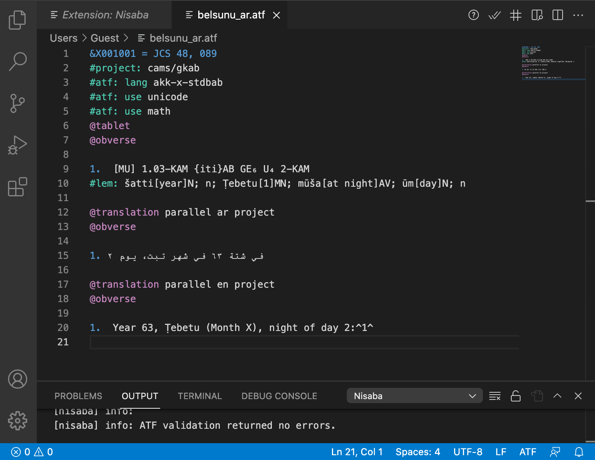

# Nisaba: The new text editor for Oracc

Nisaba is the new text editor that enables Oracc content creators to view, edit and validate documents recording the content of cunneiform tablets from
various ancient Mesopotamian cultures, translated and formatted for the modern reader.

You can find more information about it and how to install and use it in [the user guide](./docs/user_guide.md).

If you wish to contribute to the development of the Nisaba extension, we have prepared a section with [some development notes](./docs/development.md). You can get in touch with Nisaba's developers at UCL's Advance Research Computing Centre by [filing a GitHub issue on this repository](https://github.com/oracc/nisaba/issues/new).

