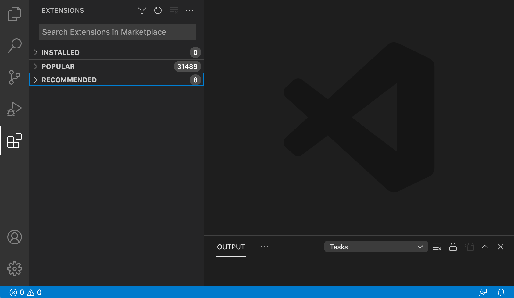
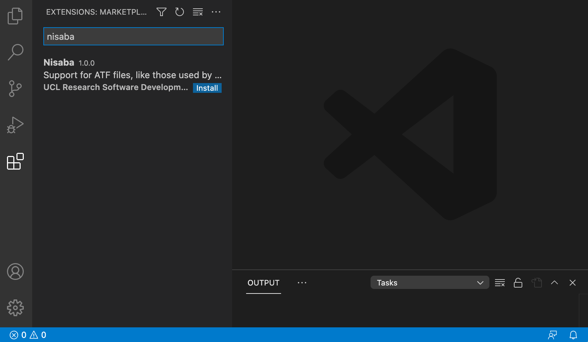

# Installing the Nisaba extension

Nisaba is an extension to Visual Studio Code (VS Code). In order to install it
on your computer, you will need to follow these steps:

1. Download and install [VS Code](https://code.visualstudio.com/download).
1. Open VS Code. You will see a screen similar to the one below: 
1. Click on the VS Codes extensions button  on the left hand side bar. This will bring up a new panel with a search field: 
1. Type "nisaba" on the search field in the extensions panel. This will show you a list of extensions relevant to your search, which in this case should include the Nisaba extension: 
1. Click on the "nisaba" extension which will display its details and a button to install the extension: 
1. Click on the "install" button.

You should now have the Nisaba extension installed in VS Code.

Please note the Nisaba extension is only visible while you are editing a file
with ".atf" extension. Otherwise, the Nisaba button panel  on the top right
won't show.
