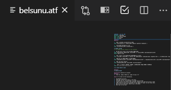
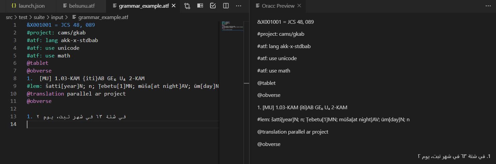

# Working with ATF files

In order to enable the Nisaba extension, you will need to open an ATF file in Visual Studio Code. In order to do this, find the "File" option on the menu bar on the top left of the window, then choose "Open File". This will prompt a new window where you can navigate to an existent ATF file in your system, then click on "Open". 

Alternatively, you can create a new file and save it with an ".atf" extension, e.g. "my_file.atf". 

Please note you can find numerous ATF files freely available on the 
[Oracc site archive](http://oracc.museum.upenn.edu/doc/search/index.html).

Once Visual Studio has detected you have opened a file with the "atf" extension, it will show the Nisaba extension buttons on the top right of the window, which allow you to lemmatise and validate your ATF file, as well as preview a right-to-left translation with its correct orientation or ask for help:

All the Nisaba buttons have tooltips, so you can hover over them and see which action corresponds to which button.

The Nisaba extension will also apply text highlighting to the ATF text in order to help Oracc editors identify potential validation problems as they type.

Once you are done viewing or editing an ATF file, simply save and close it and the extension will close with it. To save the file, choose the "File" option on the menu bar, and choose the "Save" option. Under the menu bar, there should be a tab with the same name as the ATF file opened earlier. Hovering over this tab will reveal an X, which if clicked will close the file and the Nisaba extension along with it.

## Validate an ATF

You can validate an ATF file by clicking on the validate button on the top right. It will send the contents of the ATF file to the Oracc server for validation. If the file is valid, the console will display a message saying so. Otherwise, a list of errors appears in the console and the errored lines appear highlighted in the edition panel, as shown in the images below:

## Lemmatise an ATF

You can lemmatise an ATF file by clicking on the lemmatise button on the top right. It will send the contents of the ATF file to the Oracc server, which will return a lemmatised file if valid, and reload the edition panel with the lemmatised version of the original ATF.

If the file is not valid, the console will display the error messages found by the server. Once those are fixed, you can attempt to lemmatise the ATF again.

## Right-to-left languages (e.g. Arabic, Farsi, Kurdish, Syriac...)

One key feature Nisaba has is the ability to display an ATF translation in right-to-left languages, like Arabic. In order to use this feature, you will need to have open an ATF with a translation in Arabic (or other right-to-left language). When you click on the "Show Arabic Preview" button on the top right, you will see a secondary panel to the right of the edition panel that shows the same ATF with the translation section correctly orientated for right-to-left languages.

Please note this feature is not yet available in an "as you type" fashion, so you will have to first type the translation in the main panel, then use the "Show Arabic Preview" button to check it displays correctly.

